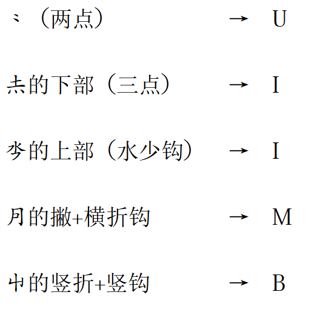
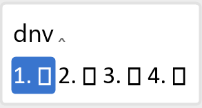

# khitan_small_script_wubi
基于Rime的契丹小字五笔输入方案

## 一、概述

​	本输入方案基于输入法内核Rime，提供.dict码表和.schema配置文件。使用时需先下载安装Rime，再挂载本方案的码表和配置文件。

## 二、背景

​	契丹小字是辽代的官方文字之一，是由耶律阿保机的弟弟耶律迭剌在学习了回鹘文之后，参考回鹘文的原则而创造，以“数少而该贯”而著称。但由于官方限制、文字不成熟、文化底蕴不足等原因，始终仅流行于贵族、知识分子中。其多见于宫廷、墓葬等场合，而并未全面取代汉字在官方、文化领域的主导地位，也未广泛用于日常书写或文学创作。

​	终辽一代，契丹小字与契丹大字、汉字等一直并行于辽朝境内。后来的西辽也继续使用汉字和契丹文字，直至亡国。

​	1125年，金朝灭辽。金朝虽然创制了女真文字，但其前半期在使用女真文字和汉字的同时，仍使用两种契丹文字。直到金章宗明昌二年四月十六日（1191年5月10日），罢免国史院专写契丹文的官员；同年十二月十一日（12月28日）“诏罢契丹字”。

​	元朝初年，契丹大、小字仍偶有使用，但其后废弃，也无契丹文书籍传世。

​	契丹小字基本算是一种音节文字，加以一些表意文字，类似谚文。其基础原字总数约三百多字，其中仍有三分之一有余没有破译。在结构上，契丹小字参考汉字字形而创制，与汉字结构极相似，因此基本能够完美适配五笔输入法。在读音上，学界对小字的发音仍知之甚少，故根据发音开发输入法基本不可行。现有的[契丹小字仓颉输入法、笔画输入法](http://www.ccamc.co/fonts_kht_jrc.php)均为形码，本五笔输入法也不例外。

## 三、使用步骤（Win11）

1. 下载[Rime输入法内核](https://rime.im/)并安装。
2. 右键Rime状态栏，选择并打开“用户文件夹”，将本项目的.yaml和.ico文件复制到该目录。
3. 右键Rime状态栏，选择“输入法设置”，并勾选“契丹小字五笔”。
4. 右键Rime状态栏，选择“重新部署”。
5. 按下ctrl+~，选择“契丹小字五笔”。
6. 下载并安装契丹小字字体，如[CCAMC KSS Kaiti](http://www.ccamc.co/fonts_kht_jrc.php)。
7. 正常使用。将打出字符的字体改为已安装的契丹小字字体，即可正常显示。

​	以上是Win11的使用步骤，其他平台的步骤类似。

## 四、输入方案介绍

​	本输入方案基于五笔86版，输入规则已尽量贴合原版，仅增加了几个易推导的字根，以最大程度上降低使用门槛。末笔识别码、取末笔规则（取折还是撇）均与86版相同。

​	本方案支持原字+部首共482个。

#### 1. 字根改动：

​	新增的字根均极易类比、推导。

#### 2. 取码情况

​	本输入方案仅支持不加识别码的全码及全码，不考虑简码。

​	键名字符需打全码，如

#### 3. 重码统计

​	据统计，全部的482个字符中，有26组52字的两码均重，但可依靠取码顺序强行区分。另有21组65字无法区分（包括众多的折笔部首）。

## 五、未解决的问题

​	本输入方案使用的字体是[CCAMC KSS Kaiti](http://www.ccamc.co/fonts_kht_jrc.php)，但在实际使用时，Rime输入法的候选词会显示方框（但输出的字符可以正常显示），我研究了两天都没解决，换用其他契丹字体也无法在候选框内正确显示。可能是配置不正确或不支持。如果有大佬能提供帮助，请联系matiasxebec@gmail.com，万分感谢！

​	方案制作仓促，可能有其他问题。如有发现，也请直接联系我。

## 六、后记

​	本人是五笔爱好者，意图用五笔实现所有东亚汉字系文字的流畅输入。契丹文是小众中的小众，本输入方案也不会有多少实际应用价值。但能实现爱好就足矣 ٩(๑•̀ω•́๑)۶

## 支持

感谢[古今文字集成](http://www.ccamc.co/)及站长Jerry的相关信息、字体的支持！

感谢Rime输入法内核的开发者们。

感谢五笔输入法的开发者王永民先生。
